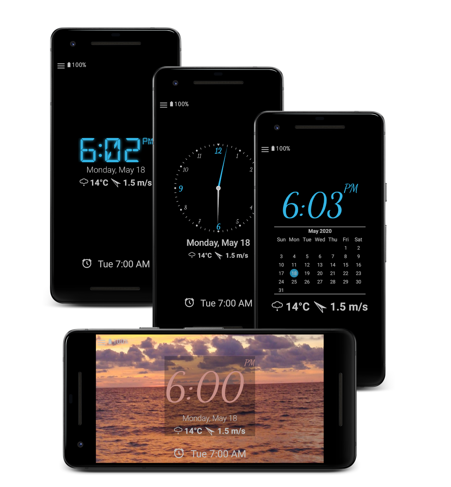

# nightdream
Open-source clock, screensaver & radio with dynamic brightness & custom features. Trusted and actively developed since 2013.

  

An open-source desk clock and screensaver, perfect for day and night. Actively maintained and refined since 2013, it shows a digital clock with auto-brightness, battery level, date, and notifications. Night mode offers a dark display (pure black on AMOLED). Adjust font size with a two-finger zoom.

## Customizable Design
Adapt colors, fonts, and analog watch faces. Resize the clock with a two-finger zoom.

## Widgets
Add a clock widget to your home screen.

## Screensaver (Daydream)
Use as a screensaver on Android 4.2+. The screen can turn off at night and reactivate based on light or sound.

## Alarms & Radio
Set quick alarms with a swipe. Listen to internet radio stations and use them for your alarm. The app can manage Wi-Fi for uninterrupted streaming.

## Smart Home Integration
Connect to your AVM smart home environment.

## Battery Status
See the estimated time until fully charged.

## Notifications
Display notifications from your favorite apps (requires Notification Access).

## Weather
Show current weather and a 5-day forecast from providers like OpenWeatherMap, Bright Sky, and Met.no.

## Extra Features
* Built-in flashlight.

## Open Source & Donations
Nightdream is free, open-source software. The source code is available for review. Support development through donations.

## Permissions Explained
* **FOREGROUND_SERVICE:** Play radio in the background.
* **READ_CALENDAR:** Access calendar events to highlight them on the clock.
* **MODIFY_AUDIO_SETTINGS:** Silence device in night mode.
* **WAKE_LOCK:** Keep screen on or wake device for alarms.
* **READ_EXTERNAL_STORAGE:** Use custom background images.
* **INTERNET & ACCESS_NETWORK_STATE:** For weather, radio, and crash reports.
* **RECEIVE_BOOT_COMPLETED:** Reschedule alarms after reboot.
* **VIBRATE:** Vibrate for alarms.
* **SET_ALARM, USE_EXACT_ALARM, & SCHEDULE_EXACT_ALARM:** Set alarms.
* **ACCESS_COARSE_LOCATION:** Get weather for your location.
* **POST_NOTIFICATIONS:** Show alarm notifications.
* **READ_MEDIA_AUDIO:** Use custom alarm sounds.
* **SYSTEM_ALERT_WINDOW:** Display clock over other apps.
* **FLASHLIGHT:** Use the flashlight.
* **ACCESS_NOTIFICATION_POLICY:** Control Do Not Disturb.
