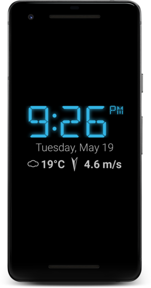
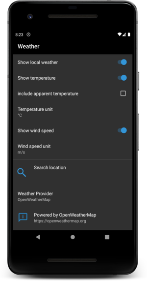
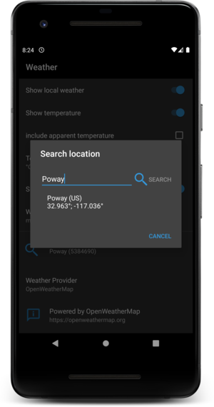
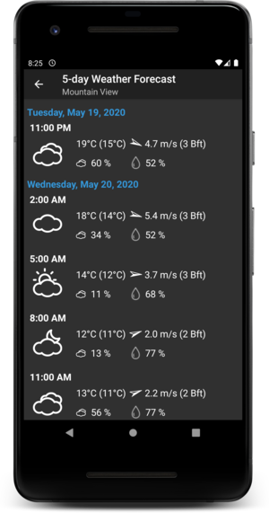

[< back](../index.md)

# Frequently Asked Questions (FAQ)

[> deutsch](faq_de.md)

## Where do I find support ?

If your question is not listed here, please try to post it to the
[public mailing list](https://groups.google.com/d/forum/night-clock):
 [night-clock@googlegroups.com](mailto:night-clock@googlegroups.com).

## Table of Contents
  * [Ads](#ads)
     * [How do I remove the ads ?](#how-do-i-remove-the-ads-)
  * [In-App payments](#in-app-payments)
     * [Which payment options do I have ?](#which-payment-options-do-i-have-)
        * [Full version](#full-version)
        * [Weather and design package](#weather-and-design-package)
        * [Web radio package](#web-radio-package)
        * [Abilities](#abilities)
        * [Donation](#donation)
  * [User Interface](#user-interface)
     * [How can I change the clock size ?](#how-can-i-change-the-clock-size-)
     * [How can I change the position of the clock ?](#how-can-i-change-the-position-of-the-clock-)
     * [The clock automatically changes its position](#the-clock-automatically-changes-its-position)
     * [The interface is locked](#the-interface-is-locked)
     * [AM/PM indicator not working properly](#ampm-indicator-not-working-properly)
     * [Custom fonts](#custom-fonts)
     * [The landscape orientation does not work](#the-landscape-orientation-does-not-work)
  * [Weather](#weather)
     * [Weather status line](#weather-status-line)
     * [Weather preferences](#weather-preferences)
     * [Location search dialog](#location-search-dialog)
     * [5-day weather forecast](#5-day-weather-forecast)
     * [Weather data is not shown](#weather-data-is-not-shown)
  * [Web Radio](#web-radio)
     * [How to play a radio stream](#how-to-play-a-radio-stream)
     * [How to remove or edit a radio station button](#how-to-remove-or-edit-a-radio-station-button)
  * [Alarms](#alarms)
     * [How do I stop or snooze an alarm ?](#how-do-i-stop-or-snooze-an-alarm-)
  * [Custom mp3 as alarm tone](#custom-mp3-as-alarm-tone)
  * [Autostart](#autostart)
  * [Night mode](#night-mode)
  * [Brightness settings](#brightness-settings)
     * [Manual brightness mode](#manual-brightness-mode)
     * [Automatic brightness mode](#automatic-brightness-mode)
  * [Widget](#widget)
     * [The clock widget is not updated](#the-clock-widget-is-not-updated)
  * [Background](#background)
     * [Black](#black)
        * [Can I choose the color for the background?](#can-i-choose-the-color-for-the-background)
     * [Transparent](#transparent)
     * [Gradient](#gradient)
        * [Can I choose the color for gradient?](#can-i-choose-the-color-for-gradient)
     * [Image](#image)
        * [Are animated gifs displayed?](#are-animated-gifs-displayed)
     * [Slideshow](#slideshow)
        * [Which pictures are shown in the slideshow](#which-pictures-are-shown-in-the-slideshow)
        * [How can I select images](#how-can-i-select-images)
        * [The slide show appears with a delay at app startup](#the-slide-show-appears-with-a-delay-at-app-startup)
        * [How can cloud storage be accessed?](#how-can-cloud-storage-be-accessed)
        * [Only a black screen is displayed](#only-a-black-screen-is-displayed)
        * [EXIF information is not displayed](#exif-information-is-not-displayed)
  * [Speak the current time](#speak-the-current-time)
     * [The current time is not read out](#the-current-time-is-not-read-out)
     * [How can the language be changed?](#how-can-the-language-be-changed)
  * [Notifications](#notifications)
     * [What is the media control?](#what-is-the-media-control)
     * [How do I activate the media control?](#how-do-i-activate-the-media-control)
     * [The media control is not displayed](#the-media-control-is-not-displayed)

## Ads

### How do I remove the ads ?

Night Clock does not show any advertisements, neither in the free version nor in the paid versions.
If you observe any ads check the other apps on your device. I don't want to contribute to a world
which is full of ads in all possible situations of life.

[Top](#table-of-contents)

## In-App payments

### Which payment options do I have ?

There a different packages available.

#### Full version

Gives access to all paid features which are described below.
The full version is only available as long as you didn't purchase one
of the packages.

#### Weather and design package

Adds weather information as a status line below the clock and a 5-day weather
forecast (cf. [weather](#weather))

Only one digital clock layout and one analog clock layout can be accessed
in the free version. The package adds new clock faces. The preview and the clock
designer interface are fully functional in the free version.

#### Web radio package

Adds the ability to play web radio streams from the main interface.
Custom sounds or radio streams can be used as alarm clock.

#### Abilities

Adds additional abilities to the app.
- Always On: Start the app automatically without connecting a power
  source.
- Scheduled Autostart: Start the app at a certain time (without
  having to setup an alarm)
- Notifications: start the app when new notifications show up.
- Turn the screen off in night mode.

#### Donation

If you like to send a special appreciation for the app you can choose a
donation. I will grant access to the paid features. As a special gift
the donation unlocks a calendar view.

[Top](#table-of-contents)

## User Interface

### How can I change the clock size ?

Using a two-finger pinch gesture you can freely resize the clock layout.

### How can I change the position of the clock ?

With a long press on the clock a frame is displayed and the clock can be freely positioned on the screen.
The position is automatically saved as soon as the clock is released.

### The clock automatically changes its position

The app offers two different options for screen protection:
- move the clock around
- fade the clock
If an automatic change of position of the clock is not desired, the screen protection mode can be changed
or disabled in the options.

### The interface is locked

If Night Clock shows a padlock symbol in the top left corner instead of the
menu icon (aka burger icon) the user interface is locked. In order to unlock
simply long press the lock icon. Vice versa the user interface is locked by
long pressing the menu icon.

If the standby mode is enabled, the user interface always starts in locked mode.

### AM/PM indicator not working properly

The seven segment font is not able to draw uppercase letters very precisely. An alternative font is
a 14 segments digital font as found at https://www.keshikan.net/fonts-e.html.

### Custom fonts

You can choose plain .ttf and .otf files, but also .zip archives which may
contain multiple font files. Just navigate to your download folder and choose
a file you downloaded before.
There are sources of free fonts in the web, such as
[fonts.google.com](https://fonts.google.com/) and
[Font Squirrel](https://www.fontsquirrel.com/).

### The landscape orientation does not work

Starting from Android 5 Daydreams have a bug. The screen orientation changes to portrait as soon
as the screen lock is activated.
* Solution 1: Disable Daydreams completely (System Settings > Display > Daydream). Instead you
can setup the auto start feature of the app to your needs.
* Solution 2: Try to enable Settings > Appearance > Force auto rotation in DayDream.

[Top](#table-of-contents)

## Weather

Screenshot                                      | Description
------------------------------------------------|-----------------------
          | Weather status line
        | Weather preferences
 | Location search dialog
        | 5-day weather forecast

### Weather status line

Shows the current temperature and optionally the wind direction and wind speed.
The weather data is updated approximately once an hour if the app is in the
foreground.

### Weather preferences

Allows to configure what is shown in the status line. If you leave the weather
location blank the app needs the permission to read your current (coarse)
location.

The default weather provider is [OpenWeather](http://www.openweathermap.org).
The weather provider [Dark Sky](http://www.darksky.net) will shut down its
service end of 2021.

### Location search dialog

You can search for a location yourself. In this case you can revoke the
permission for location access safely.

### 5-day weather forecast

The headline shows the current location which is especially useful if it
was detected automatically.

The following information shown
 - temperature (apparent temperature)
 - wind direction and wind speed
 - cloud coverage in *%*
 - humidity in *%*
 - 3 hour rain volume in *mm* (only if rain is expected)

### Weather data is not shown

Weather data may not be shown for several reasons.
* These are not displayed if outdated for more than 8 hours (e.g. in flight
  mode).
* The current location cannot be retrieved:
  - Can you retrieve weather information, when defining the location manually ?
  - Please grant permissions for accessing the location (Android 6+)
  - Please check if your location services are activated (e.g. battery saving
    or high accuracy)
* The network may not be connected. Check your network connection.

[Top](#table-of-contents)

## Web Radio

### How to play a radio stream

The web radio panel appears by tapping the radio icon from the sidebar.

Tab the "+" button to add a new radio station to the panel. You can search for radio stations or
enter a url you know. This can be a plain mp3 stream url but also m3u/pls playlists.

Stop playing a radio station by pressing its button again.

### How to remove or edit a radio station button

Just tap on a radio station button a bit longer ("long press") to open the radio streams
configuration window. There you can alter the radio stream for that button or remove it.

[Top](#table-of-contents)

## Alarms

### How do I stop or snooze an alarm ?

An alarm is stopped by tapping the lower right corner. Snooze is enabled by tapping anywhere else.
The snooze time is adjustable in preferences > alarms.

Upcoming alarms can be stopped from the notification area. The notification is
shown approximately one hour before the alarm time.

## Custom mp3 as alarm tone

In the dialog for setting the alarm tone you can choose your custom MP3 file, at the bottom of the
dialog. Just navigate to your music folder and select the file you like. With the next release this
dialog will move to the alarm overview allowing you to set different alarm tones per alarm.

[Top](#table-of-contents)

## Autostart

The app has different options for auto starting. If you enable the autostart it starts as soon as
it gets connected to a power source. If the app is interupted it waits until the device goes back
into standby, i.e. the screen turns off and restarts the night clock. The "always on" feature is
starting the app while the device is not charging. In order to save some battery I advise to stop
the app after some minutes (Preferences > Autostart > Stop automatically > on battery timeout).

[Top](#table-of-contents)

## Night mode

Night Clock has two modes of operation: day mode and night mode.

The night mode has the following features:
* You can set different colors.
* There is no automatic brightness control. The display brightness is set to a fixed value, even
  if the automatic brightness feature is enabled.
* The display may be switched off. The display is switched back on if the luminosity exceeds a
  predefined value (default: 20 lux). If the ambient noise detection is activated, then noise will
  also re-activate the screen. Noise may also slightly increase the brightness of the display in
  both of the modes.
* The night mode can be activated automatically as soon as it gets dark (and silent if ambient
  noise detection is active). Other modes of activation are *scheduled* and *manual*. These are
  meant for devices which do not have a light sensor. If you want to benefit from the automatic
  brightness control you should leave the night mode activation settings at *automatic*.

[Top](#table-of-contents)

## Brightness settings

### Manual brightness mode

Sliding along the upper rim of the display you can tune its brightness. The app remembers the
current brightness value in night mode which is different from the setting in day mode. Thus,
when the mode changes the brightness may increase/ decrease.

While operating on battery the brightness may never be larger than the maximum brightness value
defined at *Preferences > Appearance > Maximum screen brightness on battery*

### Automatic brightness mode

In the automatic brightness mode the device sets the display brightness depending on the luminosity.
The brightness is automatically set within the pre-defined bounds of the *minimum brightness* and
the *maximum brightness*. If the device is on battery another value of the maximum brightness is
used.  The *maximum brightness on battery* should be reduced as much as possible as the display
consumes most of the energy.

Changes in the ambient light conditions should take effect after approximately 20s.

The *brightness offset* helps to adjust the automatic brightness control to your personal needs.
The type of the display, eg. LCD or AMOLED, and the colors shown on the display, have a strong
influence on how the display looks like. With the offset you can tune the brightness to be lower
or brighter than the default value *0*. Because in low light conditions another offset is needed
than in a bright environment, the offset can be tuned from the main view by sliding your finger
along the upper rim of your display.

In low light conditions the automatic brightness control may not be very accurate. This is due to
the fact that most of the devices do not report accurate values below 10 lux.

[Top](#table-of-contents)

## Widget

### The clock widget is not updated

The clock widget needs to be updated once per minute. Due to restrictions of the Android system
this is a difficult task. In order to ensure that the update works a foreground service is needed.
The same service is managing the autostart of the app. It is indicated by showing a permanent
notification in the notification area. If this service is not properly running (or interrupted by
the android system) the widget is no longer updated. If you want to (re-) enable this service you
can disable and re-enable the autostart of the app. This triggers the start of the service.

[Top](#table-of-contents)

## Background

### Black

Shows a black background.

#### Can I choose the color for the background?

It is currently not possible to select any other color

### Transparent

Shows the mobile background.

### Gradient

Zeigt eine dunklen Farbverlauf als Hintergrund an.

#### Can I choose the color for gradient?

It is currently not possible to select any other color .

### Image

Shows an image as background.

#### Are animated gifs displayed?

Yes, since version 2.10.18.

### Slideshow

#### Which pictures are shown in the slideshow

The app shows all images in JPG and PNG format.
Videos or images in any other format are not displayed.
It is currently not possible to select individual images for the slideshow.

#### How can I select images

For Android Lollipop (version 5.0) and above a folder can be selected for displaying images.
It is currently not possible to select individual images for the slide show.
It is recommended to create your own folder and copy the images you like for the slide show into this folder.
For Android Versions below Lollipop the device's photo directory is selected automatically.

#### The slide show appears with a delay at app startup

The loading of the individual images takes place in the background to ensure smooth operation of the app.
On older devices or large images it may take some time before the image is ready to be displayed.
In this case please try to reduce the size of the problematic image.

#### How can cloud storage be accessed?

It is currently not possible access to any cloud storage.

#### Only a black screen is displayed

Please check if there are pictures in JPG format on the device.
The option * Hide the background image in night mode * may be activated.
If so, a black background is shown instead of a slideshow during the night.

#### EXIF information is not displayed

Please check whether EXIF information is included in the displayed JPG image.
To determine the location from the EXIF information the Google Play Services are required.
Some Android distributions may not have these preinstalled.

[Top](#table-of-contents)

## Speak the current time

### The current time is not read out

The app requires an installed text-to-speech engine (TTS) to read the current time.
Please check in the device settings whether this is installed and activated on your device.

### How can the language be changed?

The selected language depends on the language of your device and cannot be changed within the app.

## Notifications

### What is the media control?

The media control makes it possible to take control of external music players which are controlled
through the notification center.

### How do I activate the media control?

The media control notifications can be activated in the app preferences in the notifications section.
If a compatible app is running in the background (e.g. Google Play Music, Spotify, Amazon Music,
Pulsar, MyBob etc.) the media control is displayed below the clock.

### The media control is not displayed

There are some apps that do not use the standard Android interfaces for music control.
These apps cannot be viewed and controlled via the media controls.

[Top](#table-of-contents)