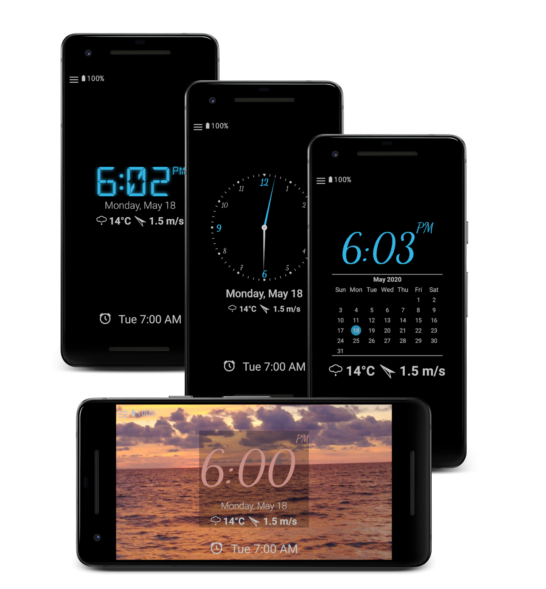

# Nightdream – Die vielseitige Nachtuhr & Digitaluhr App

[🇬🇧 English version](index.md)

  

  

Nightdream ist eine leistungsstarke **Open-Source Tischuhr** (Desk Clock) und ein vielseitiger **Bildschirmschoner** (Daydream), perfekt für den Einsatz bei Tag und Nacht. Die App bietet eine **große Digitaluhr** mit automatischer Helligkeitsanpassung, Akkustand, Datum und Benachrichtigungen. Der optimierte Nachtmodus bietet ein extrem dunkles Display (echtes Schwarz auf AMOLED) – die ideale **Nachtuhr** für deinen Nachttisch.

## Individuelles Design & Große Uhr
Passen Sie Farben, Schriftarten und analoge Zifferblätter nach Ihren Wünschen an. Die Größe der **Uhr** lässt sich einfach per Zwei-Finger-Zoom (Pinch-to-zoom) verändern – perfekt für eine **Vollbild-Uhr** (Full Screen Clock). Auch ein klassischer **Flip Clock** Stil ist für Liebhaber von Retro-Designs verfügbar.

## Uhr Widget für den Home-Bildschirm
Nutzen Sie das praktische **Clock Widget**, um die Zeit immer im Blick zu behalten. Gestalten Sie Ihren Homescreen mit einem funktionalen und ästhetischen Zeitmesser.

## Bildschirmschoner & Always on Display (AoD)
Verwenden Sie Nightdream als **Screensaver (Daydream)** ab Android 4.2+. Die App eignet sich hervorragend als **Always on Display Clock**, die sich nachts automatisch ausschalten und bei Licht wieder aktivieren kann. So verwandeln Sie Ihr Smartphone in eine elegante **Tischuhr**.

## Wecker & Internetradio
Stellen Sie schnelle Alarme mit einem einfachen Wisch. Hören Sie Ihre liebsten Internet-Radiosender und lassen Sie sich von ihnen wecken. Die App kann sogar das WLAN verwalten, um unterbrechungsfreies Streaming für Ihren **Radio-Wecker** zu garantieren.

## Smart Home Integration
Verbinden Sie Ihre **Uhr App** mit Ihrer AVM Smart-Home-Umgebung (Fritz!Box), um beispielsweise Lichter oder Steckdosen direkt zu steuern.

## Akku-Status & Benachrichtigungen
Behalten Sie den Ladestatus im Auge und sehen Sie die geschätzte Zeit bis zur vollständigen Aufladung direkt auf Ihrer **Nachtuhr**. Nightdream kann zudem Benachrichtigungen Ihrer Lieblings-Apps anzeigen (erfordert Zugriffsberechtigung).

## Wetteranzeige
Die App zeigt das aktuelle Wetter sowie eine 5-Tage-Vorhersage von zuverlässigen Anbietern wie OpenWeatherMap, Bright Sky oder Met.no an.

## Weitere Features der Nightdream App
* Integrierte Taschenlampe für den schnellen Einsatz nachts.
* Optimiert für **Digital Clock Wallpaper**-ähnliche Optik im Vollbildmodus.
* Komplett werbefrei. Nur die Basisfunktionen sind kostenlos.

## Open Source & Unterstützung
Nightdream ist freie Open-Source-Software. Der Quellcode ist öffentlich einsehbar und lädt zum Mitmachen ein. Unterstützen Sie die Weiterentwicklung gerne durch eine kleine Spende oder das Freischalten von Premium-Funktionen.

# FAQ / Häufig gestellte Fragen
[🇩🇪 Häufig gestellte Fragen (de)](faq/faq_de.md)

# Übersetzung beitragen
Möchten Sie Nightdream in eine weitere Sprache übersetzen?
1. Laden Sie die originale `strings.xml` Datei [hier](https://github.com/firebirdberlin/nightdream/blob/master/app/src/main/res/values/strings.xml) herunter.
2. Übersetzen Sie die Texte in der Datei.
3. Senden Sie die übersetzte Datei an [stefan.fruhner+nightdream@googlemail.com](mailto:stefan.fruhner+nightdream@googlemail.com).

---
[Datenschutzbestimmungen (Privacy Policy)](privacy.md)
